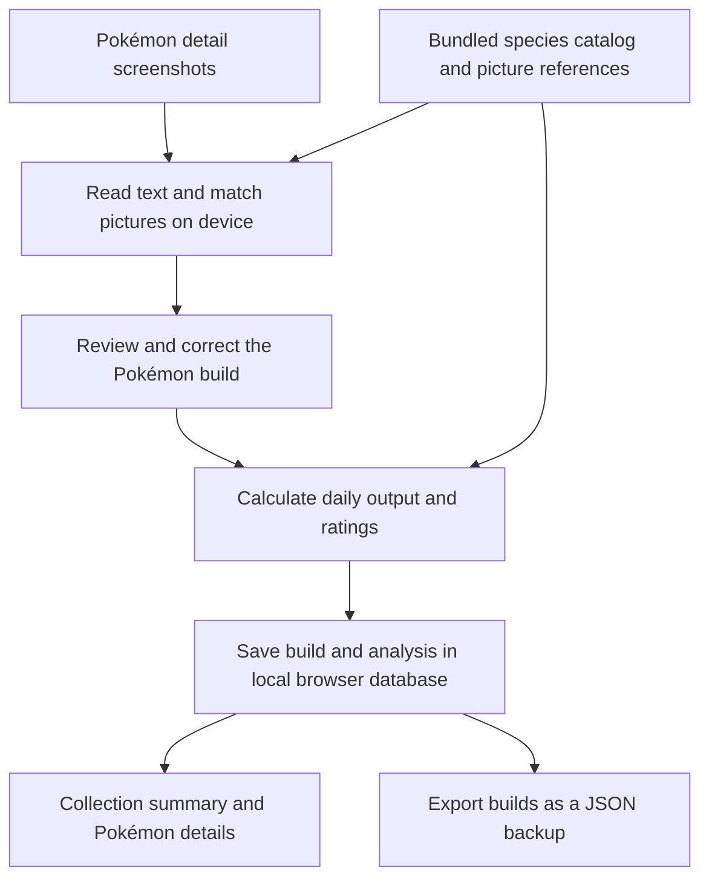

# How Sleep Atlas works

Sleep Atlas turns Pokémon Sleep detail screenshots into a collection of Pokémon builds, estimates their daily output, and compares each build with other builds of the same species. Screenshot reading, calculations, and saving run on your device. The website supplies the app and a bundled Pokémon catalog; it does not synchronize your collection between devices.

This guide describes the hosted app as of **Reader v29, October 6, 2026**, using calculation model `atlas-1.4-web`. The original Mac app has a separate storage system and an older interface.

## From screenshot to collection



Open the top **⋮** menu and choose **Add Pokémon**. Import screenshots for one Pokémon at a time, review the extracted fields, and choose **Analyze & save**. You can also enter a Pokémon manually. Saving validates the fields; there is no separate confirmation checkbox.

The saved build contains species, nickname, level, nature, five ordered subskills, three ingredient choices, main skill level, carry limit, helping frequency when available, notes, and analysis settings. Screenshots are evidence for those fields; daily production and ratings are calculated separately.

## Where Pokémon data comes from

The catalog comes from [Neroli’s Lab](https://github.com/nerolis-lab/nerolis-lab), with its source commit and retrieval date recorded. It supplies species base frequency, inventory, berry type and value, ingredient options and quantities, main skill effects, and ingredient and skill probabilities. The probabilities are community research values, not officially published game guarantees.

Reader v26 includes **249 Pokémon and forms**, pinned to commit [`74e5068c1fa76518803caa8705798389da7f635d`](https://github.com/nerolis-lab/nerolis-lab/tree/74e5068c1fa76518803caa8705798389da7f635d). The app also bundles reference pictures converted into compact numerical patterns for matching Pokémon portraits and ingredient icons.

### How updates reach your phone

Catalog updates are currently manual releases. A maintainer checks upstream changes, updates the catalog and matching references, tests them, and publishes a new app version. **Check for updates** loads the latest published Sleep Atlas version. It does not query live game data or independently pull new Pokémon from Neroli’s Lab. There is no scheduled catalog updater.

The catalog version also controls calculation freshness. When you load a saved collection with a newer catalog or model, the hosted app recalculates the displayed analysis. It keeps the saved build, timestamps, screenshots, and earlier analysis history intact. Saving an edit creates a new analysis history entry.

### Why Foongus was missing

The earlier catalog contained 247 species and forms and had no Foongus entry. Reading the word “Foongus” was insufficient because the app could not connect it to supported species data or a reference portrait. Reader v26 added both Foongus and Amoonguss, including their normal and shiny picture references.

Your screenshot now matches this build:

| Field | Value |
| --- | --- |
| Species and level | Foongus, level 14 |
| Nature | Hasty |
| Carry limit | 12 |
| Helping frequency | 1 hr 32 min 31 sec |
| Ingredient slots at levels 1, 30, 60 | Tasty Mushroom ×2, ×5, ×7 |
| Subskills at levels 10, 25, 50, 70, 80 | Skill Trigger S; Inventory Up S; Ingredient Finder S; Energy Recovery Bonus; Ingredient Finder M |

Foongus’s catalog base frequency is 5,700 seconds. With level 14, Hasty’s neutral helping-speed effect, and no active speed subskill, the calculation is `floor(5700 × (1 − 0.002 × 13)) = 5551` seconds, matching the screenshot. The locked mushroom slots are saved now but contribute to production only when their unlock levels are reached.

## How screenshot recognition works

The hosted app uses **Tesseract.js**, an English text reader running in the browser. It does not send the screenshots to ChatGPT or another cloud vision service.

1. **Read the text.** The app enlarges small screenshots and reads both the original colors and a high-contrast version. Text positions help distinguish the Pokémon’s level from ingredient or subskill unlock labels.
2. **Identify the species.** It looks for a catalog species name and separately compares the portrait against normal and shiny references. A custom nickname can therefore still be recognized by its picture. If text and picture disagree, the app asks for a manual species choice.
3. **Place the subskills.** It uses labels, word positions, and the two-column grid to assign slots at levels 10, 25, 50, 70, and 80. A mostly readable grid can trigger another text-reading pass over the missing cell. Recognizing a skill name without locating its slot is not enough to fill an arbitrary dropdown.
4. **Identify ingredients.** The second and third ingredient icons are compared with normal and faded references. Matches must be sufficiently clear and valid for that species, slot, and quantity when readable. The first ingredient uses the species’ fixed catalog option.
5. **Keep uncertain values editable.** Missing, conflicting, or ambiguous results are left for review. Non-English nickname text is not automatically filled, even when the species is identified from its portrait.

If recognition fails, first check the app version and species list. For a supported species, use a clearer detail screenshot with the header, frequency, ingredient icons, and subskill grid visible. Selecting the species manually can resolve ingredient matches that require species context. Several screenshots may describe one Pokémon, but screenshots of different Pokémon should be imported separately.

## How daily estimates are calculated

All production figures are expected totals over **24 hours**, so fractional counts are normal. The app models average behavior rather than replaying every in-game help.

### Helping frequency and carry limit

The frequency shown in Pokémon details can be the value read from the screenshot or entered manually. It is retained as the Pokémon’s own displayed stat. **That recorded value does not override the production model**, which calculates frequency from catalog data and the selected settings.

For the Pokémon’s own calculated stat, the app applies species base frequency, a level factor of `1 − 0.002 × (level − 1)`, the nature’s speed effect, and active Helping Speed S/M subskills. The production model additionally includes Helping Bonus and teammate Helping Bonus, with the combined subskill speed reduction capped at 35%. It then applies an assumed average energy multiplier to the number of helps per hour.

Calculated carry limit starts with species base inventory, adds five per previous evolution, and adds active Inventory Up bonuses. When you change evolution or level, the editor preserves the difference between the recorded carry limit and this baseline, so an existing additive bonus is not lost or repeatedly added. Recorded and calculated values remain editable.

### Ingredients and skills

Only unlocked ingredient slots contribute: the first slot from level 1, the second from level 30, and the third from level 60. The model treats unlocked selected slots as equally likely on an ingredient help. Base ingredient probability is adjusted by nature and active Ingredient Finder subskills.

Inventory capacity limits normal production between collections. The default routine assumes 8.5 hours of sleep and collection every three waking hours. Once modeled inventory is full, excess helps become berry-only sneaky snacking; they do not add modeled ingredients or skill triggers.

Skill probability uses the species rate, nature, and active Skill Trigger subskills. The estimate accounts for storing at most one activation between collections, or two for skill specialists and all-rounders. The displayed main skill level is used without adding a Skill Level Up bonus again. For Mew, the stored level is retained, but the selected effect is capped at its supported maximum.

### Berries and total strength

Berry specialists and all-rounders start with two berries per berry help; other specialties start with one. Active Berry Finding S adds one. Berry value grows with level using the larger of the catalog’s linear and exponential growth formulas.

For supported berry-producing skills, total berries also include expected activations multiplied by the Pokémon’s own berries per activation. Berry Burst, Disguise, Draco Meteor, and Lunar Blessing use this treatment, with solo assumptions for team-dependent skills. The collection shows berry count for these builds instead of skill count. Details still show both metrics.

```text
Total berries = gathered berries + modeled own berries from skills

Total raw strength = berry strength
                   + gathered ingredients at their base values
                   + supported direct skill strength
```

Favorite berry multipliers affect berry strength, including modeled skill berries, but do not increase berry counts. The area bonus scales modeled strength. The screenshot’s RP number is not used as daily strength; daily strength is calculated from expected production. Ingredient Magnet’s extra ingredients are shown separately because their types and strength depend on the player’s unlocked ingredient pool.

Mew’s selected main skill is saved in its build. Supported selected effects use the same calculation rules, while Mew retains its own species data. Its rates are provisional; the base skill chance defaults to a 4% assumption and is editable. **Berry Juice is not currently a selectable Mew effect or a modeled berry source.**

### What the estimates leave out

Raw strength excludes recipe multipliers, critical meals, most support effects, teammates’ skill berries, Berry Zone strength boosts, and random ingredient skill strength. The model does not simulate energy recovery throughout the day, skill pity, full team synergy, camp tickets, event bonuses, or ribbon effects automatically. A recorded carry value can still include an actual bonus.

These estimates support consistent comparisons under shared assumptions. They are not exact forecasts of Snorlax’s final strength.

## What a rating means

Each metric is compared with **1,000 deterministic sample builds of the same species and level**. The comparison keeps ingredient choices, main skill selection and level, routine, and the build’s underlying carry allowance fixed. It varies nature and five unique subskills, applying only those unlocked at the chosen level and adjusting inventory bonuses.

The samples use all 25 natures uniformly and do not weight subskills by in-game rarity. A rating near 90 means the result is around the 90th percentile of these synthetic builds; ties share a midpoint rank. It is not a comparison with other species, the user’s collection, or the real player population.

Skill triggers, strength, ingredient count, total berries, and individual ingredients have separate ratings. The highest strength rating need not imply the best support Pokémon because many support effects are excluded.

## Collection controls and previews

The collection defaults to **Highest strength**. The name filter matches the beginning of either nickname or species name. The **Pokémon type** filter means specialty—Berry, Ingredient, Skill, or All-rounder—rather than elemental type.

Sorting defaults to highest strength. Choose Fastest speed to sort by the Pokémon’s own helping frequency, shortest interval first, and display that frequency in the last column. Missing readings appear last as “Not recorded.” Highest rating displays the strength percentile out of 100 in the last column. Other sorts keep the usual specialty counts. Temporary levels apply to these values too.

Tap a row to see its details. Swipe left or right through the current filtered and sorted collection. Edit opens the saved build; species choices are restricted to that Pokémon’s evolution family. New entries can select any supported species. Delete is inside Edit, and leaving unsaved edits asks for confirmation.

| Control | Effect | Persistence |
| --- | --- | --- |
| Temporary level | Recalculates collection and details at 25, 30, 50, 60, 70, or 80, including relevant unlocks, carry, and frequency | Clears on reload; does not change saved builds |
| Favorite berries in the overflow menu | Selects up to three berry types with a 2× or 2.4× strength multiplier | Remembered on this device; not included in Pokémon backups |
| Use saved settings for favorites | Removes the collection override and uses each Pokémon’s individual setting | Remembers removal of the override |
| Future levels in details | Projects levels 30, 60, 70, and 80 above the current displayed level | Derived estimates; main skill level stays fixed |

An applied empty favorite selection gives every berry ordinary strength. Temporary level and favorite berry overrides affect collection totals and sorting; editing or exporting still uses the actual saved builds. The Future levels table does not change the collection sort. Levels above 70 are labeled hypothetical projections, not a claim about the current game cap.

## Saving duplicates and making backups

When adding a new entry, the app checks for the same species, nature, ordered ingredient choices, selected Mew skill, and ordered subskills. Subskills may match or upgrade within the same family, such as Skill Trigger S to M. Unknown slots must match exactly. Level, nickname, notes, and routine settings do not identify the Pokémon.

Carry limit and main skill level must match or change by the corresponding active subskill bonus. A qualifying import replaces the current matching record while preserving its analysis history. Explicit edits keep their selected record ID. This is a stats-based match, not a game-issued Pokémon identity, so two distinct Pokémon with matching builds can be merged.

The hosted app stores Pokémon, analyses, history, and screenshot blobs in **IndexedDB**, the browser’s local database. A separate local store holds the draft, cache, and favorite berry preference. Hosting the app does not upload this collection. Different browsers, devices, and Home Screen storage contexts can have separate collections.

**Export backup** creates JSON containing Pokémon IDs, builds, notes, and individual settings. It leaves out screenshots, recognized text, analysis history, and collection-wide favorite berry preferences. **Restore** validates the backup, recalculates analyses, adds missing IDs, and skips IDs already present; it does not replace an existing record with the same ID. Older backups containing screenshots remain supported.

Use Export and Restore to move a collection between devices. Export regularly: browser data can be cleared or evicted. The Home Screen installation and private website sign-in do not provide cloud backup. Use the offline download option below to prepare this browser or Home Screen app before disconnecting. Sign-in may still require a connection.

## Downloading for offline use

While connected, open **⋮ → Download for offline use**, then choose **Download for offline use** in the dialog. The full download is about 16 MB. Keep the app open until it shows **Ready for offline use**. The download includes the app, catalog, portrait and ingredient references, English recognition data, the OCR worker, and both supported LSTM engine variants.

The dialog checks that all 32 required files are present in the current caches. Setup waits for the offline worker to activate before downloading. Failed setup can be retried without clearing the collection. It reports progress, keeps successfully downloaded files after an interruption, and retries missing files. A failed download, a full device, or a sign-in response cannot produce a successful readiness result. Reopen this menu to check the files again, especially before travelling.

On an iPhone or iPad, use **Add to Home Screen**, launch Sleep Atlas from its icon, and download inside that app. A download in a Safari tab may not be available in the Home Screen app’s separate storage. Once ready, the same app can open its collection, calculate, save, and read screenshots offline. Updates and sign-in may require internet. The browser can clear downloaded files; this download does not replace an exported collection backup.

App updates replace the smaller app cache. The larger OCR files use a separately versioned cache and survive updates when their versions have not changed. The readiness check always examines actual cached files rather than trusting a saved success flag.

## Maintaining the catalog and implementation

For each catalog release, compare the pinned upstream snapshot and source definitions with the proposed new commit. Review changed statistics and uncertainties, update both catalogs, and add picture references for new species or ingredients. Preserve the deterministic reference builds unless intentionally changing the rating model.

Before publication, check species and ingredient coverage, evolution links, screenshot regressions, calculations, and saved-data behavior. Record the source commit and retrieval date, bump the Reader and service-worker cache versions, and publish the static hosted app. Catalog and model versions in analysis results identify the assumptions used. A GitHub commit alone does not update the installed app; the new site version must also be published.

| Responsibility | Main implementation |
| --- | --- |
| Interface, edit flow, dialogs | [app.js](../hosted/dist/app.js) |
| Text recognition and slot parsing | [ocr.js](../hosted/dist/ocr.js), [ocr-parser.js](../hosted/dist/ocr-parser.js) |
| Portrait and ingredient matching | [sprite-matcher.js](../hosted/dist/sprite-matcher.js), [ingredient-matcher.js](../hosted/dist/ingredient-matcher.js) |
| Daily output and ratings | [engine.js](../hosted/dist/engine.js) |
| Own frequency and carry calculations | [pokemon-stats.js](../hosted/dist/pokemon-stats.js) |
| Local storage, restore, and analysis refresh | [local-api.js](../hosted/dist/local-api.js) |
| Duplicate matching | [build-identity.js](../hosted/dist/build-identity.js) |
| Temporary levels and favorites | [level-preview.js](../hosted/dist/level-preview.js), [favorite-berries.js](../hosted/dist/favorite-berries.js) |
| Hosted and Mac catalogs | [hosted catalog](../hosted/dist/catalog.json), [Mac catalog](../catalog/pokemon.json) |
| Offline downloads and cache | [offline.js](../hosted/dist/offline.js), [sw.js](../hosted/dist/sw.js) |

The `/api/...` paths in the hosted JavaScript are handled by the local API function; they are not requests to a cloud Pokémon database. The original Mac edition instead uses [server.py](../server.py), [analysis_engine.py](../analysis_engine.py), Apple Vision OCR, and SQLite. See the [project README](../README.md) for Mac setup and the [hosted README](../hosted/README.md) for implementation history and test commands.

The [Foongus regression test](../hosted/tests/catalog-update.mjs) covers the reported screenshot’s fields, portrait, faded mushroom icons, catalog stats, and evolution. Other suites cover legacy screenshot cases, calculations, deduplication, storage, and non-destructive previews. Source data is distributed with the project’s Apache 2.0 attribution; Pokémon artwork and names belong to their respective rights holders.
